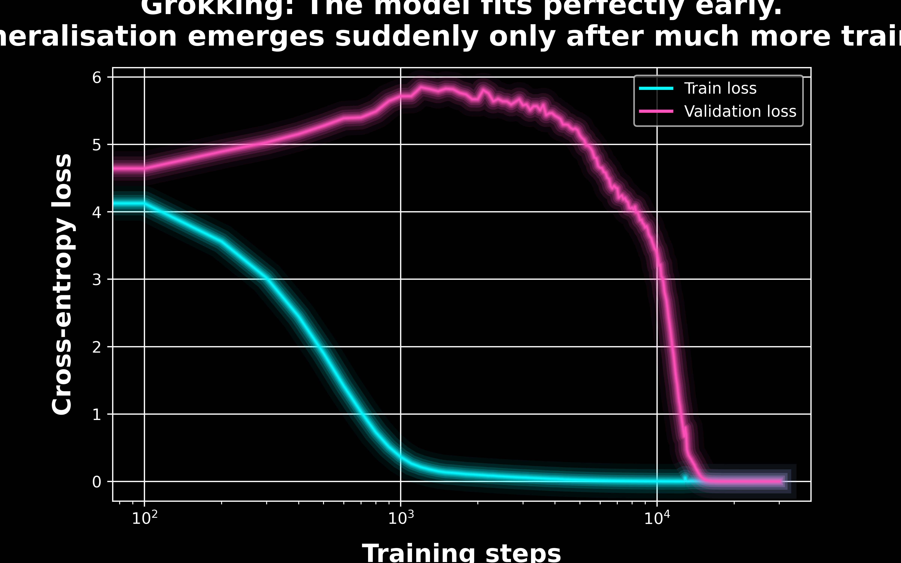

#  Let's play with GPTs.

This repository experiments with GPTs. It was sparked by Andrej Karpathy's brilliant video: https://www.youtube.com/watch?v=kCc8FmEb1nY.
![1_shakespeare.gif][1_shakespeare.gif]

## Repository

- `1_shakespeare.ipynb`: gradually implement a GPT from scratch following https://www.youtube.com/watch?v=kCc8FmEb1nY.

![1_shakespeare.gif][1_shakespeare.gif]

- `2_grokking.ipynb`: implement a model exhibiting Grokking

