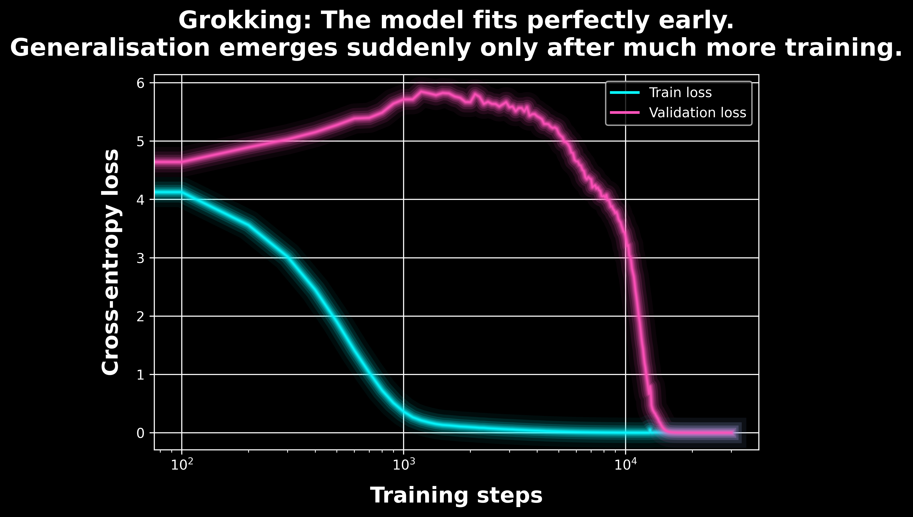

# Let's play with GPTs

This repository experiments with GPT-style language models.
It was sparked by Andrej Karpathy's brilliant videos on GPTs:
- [Let's build GPT: from scratch, in code, spelled out.](https://www.youtube.com/watch?v=kCc8FmEb1nY)
- [Let's reproduce GPT-2 (124M)](https://www.youtube.com/watch?v=l8pRSuU81PU)
as well as the corresponding GitHub repositories
- [nanoGPT](https://github.com/karpathy/nanoGPT)
- [nanochat](https://github.com/karpathy/nanochat)

  

## Repository contents

### 1. Shakespeare from scratch

- `1_shakespeare.ipynb`
  Gradually implements a GPT from scratch following Karpathy’s video.

  

### 2. Grokking in modular arithmetic

- `2_grokking.ipynb`
  Implements a small model that exhibits **grokking**: memorization followed by sudden generalization.

  

### 3. Train GPT2 from scratch

- `3_gpt2.ipynb`
  Implements the inference and training code for OpenAI's GPT2 model. I pre-trained the GPT2 the model on (Lambda)[lambda.ai] using 8 x A100 (40B) for ~2h on 5B tokens which, together with some smaller experiments, cost ~$30 in total (surprisingly cheap in my opinion).

  

